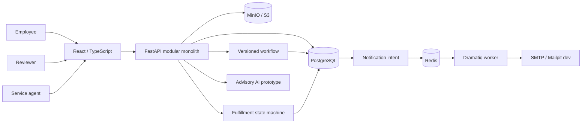

# CentralOps AI

**Governed employee requests from structured intake through human approval, service fulfillment and asynchronous communication.**


CentralOps AI is a portfolio-oriented internal service portal built as a modular
monolith. Its verified governed path is:

**published catalog -> versioned private draft -> deterministic assigned approvals ->
authorized attachments -> service-team fulfillment -> request timeline/audit ->
durable in-app notification -> asynchronous email delivery**.

AI remains advisory. It never grants authorization, chooses final approval authority
or bypasses deterministic workflow and service rules.

## Current capability: M2-M6

An employee selects a published service, saves a typed private form, optionally adds
authorized attachments and explicitly submits. The workflow resolves scoped human
reviewers, snapshots the form/workflow version and records Approve, Reject or Request
changes. Final approval creates exactly one work item for the snapshotted owner
service team.

Authorized service staff claim/receive the work, start it, optionally wait for the
requester, resume, resolve with an outcome and close it. Only closure marks the request
completed. The timeline and audit store the governed lifecycle.

M6 adds durable notification intent in PostgreSQL. Approval/fulfillment transitions
create in-app and email intents inside their database transaction, while Redis +
Dramatiq deliver email asynchronously after commit. The workspace bell exposes
recipient-scoped unread/read state. Mailpit is the local development email catcher.

Start with [M6 notifications](docs/M6_ASYNC_NOTIFICATIONS.md),
[M5 fulfillment](docs/M5_SERVICE_FULFILLMENT.md),
[M4 activity/audit](docs/M4_ACTIVITY_AUDIT.md),
[M3 approvals](docs/M3_WORKFLOW_APPROVALS.md),
[M2 catalog/drafts](docs/M2_CATALOG_DRAFTS.md), and the canonical
[Project Progress](docs/PROJECT_PROGRESS.md).

| Area | Implemented | Boundary |
|---|---|---|
| Identity | Argon2, access JWT, rotating hashed refresh sessions, normalized roles | Secure cookies, stronger revocation/rate limits remain |
| Catalog | Published immutable form versions, typed renderer, private drafts | Advanced conditional form rules remain |
| Approval | Sequential ALL steps; deterministic USER/MANAGER/ROLE/TEAM_LEAD resolvers; exact-assignee decisions | No conditional/ANY routing or delegation |
| Activity/audit | Timeline, public discussion, internal notes, safe audit metadata and append-only guards | Not WORM/tamper-proof against a DB owner; retention policy remains |
| Attachments | MinIO/S3 bytes, bounded presigned upload, authorized short-lived download and completion validation | Malware scanning/checksum/retention/multipart remain |
| Fulfillment | Exactly-one work item, scoped queue, assignment, start/wait/resume/resolve/close | SLA-at-risk semantics and richer staffing UX remain |
| Notifications | PostgreSQL intent, in-app unread/read state, Redis/Dramatiq worker, Mailpit email and persisted retry | Production provider/idempotency, push/Teams/Slack and realtime delivery remain |
| Data integrity | Transactions, row locks, optimistic versions, uniqueness and PostgreSQL race probes | CI races are not a load benchmark |
| AI prototype | Mock/Ollama/OpenAI-compatible legacy triage and lexical policy helper | Evaluated schema-aware AI intake and pgvector RAG remain planned |
| Power Platform assets | Connector/formula/flow specifications | Real Microsoft tenant evidence is not verified |

## Quick start - Windows + Docker

Requirements: Git and Docker Desktop with the Linux engine running.

```powershell
Set-Location "C:\AI_project\central-service-ai-automation"
git status --short
git fetch origin
git switch main
git pull --ff-only origin main
docker compose up -d --build --wait --wait-timeout 180
docker compose exec api alembic current
docker compose exec api python -m app.db.seed_catalog
docker compose exec api python -m app.db.seed_workflows
Invoke-RestMethod "http://localhost:8000/health"
Invoke-RestMethod "http://localhost:8000/ready"
Start-Process "http://localhost:3000"
Start-Process "http://localhost:8025"
```

M6 migration head: **`i0e4g7d9f156`**, following Phase 8 `h9d3f6c8e045`.
Do not delete persistent volumes to switch schema versions. Back up important
development data before migrations. Seed commands use synthetic local demo data and
skip existing catalog/workflow definitions.

### Demo accounts

| Role | Email | Local-only password |
|---|---|---|
| Requester | `employee@centralops.demo` | `Employee123!` |
| Direct manager | `manager.finance@centralops.demo` | `Manager123!` |
| Service lead / final reviewer | `service.lead@centralops.demo` | `ServiceLead123!` |
| Service agent | `service.agent@centralops.demo` | `ServiceAgent123!` |
| Prototype approver | `approver@centralops.demo` | `Approver123!` |
| Administrator | `admin@centralops.demo` | `Admin123!` |
| Read-only auditor | `auditor@centralops.demo` | `Auditor123!` |

Demo sequence:

1. Requester: **Service catalog -> Save draft -> optional attachment -> Submit**.
2. Manager then final reviewer: **Approvals -> Approve**.
3. Service Agent: open `http://localhost:3000/service-queue`, claim/start/resolve/close.
4. Requester: inspect **Submitted requests**, timeline and notification bell.
5. Open Mailpit at `http://localhost:8025` to inspect development email delivery.
6. Auditor/Admin: inspect **Audit log** metadata.

Web: `http://localhost:3000`  
Service queue: `http://localhost:3000/service-queue`  
Mailpit: `http://localhost:8025`  
API docs: `http://localhost:8000/docs`

Stop without deleting data:

```powershell
docker compose down
```

## Architecture



Stack: Python 3.12, FastAPI, SQLAlchemy 2, Alembic, Pydantic, React 19/TypeScript,
PostgreSQL 16, Redis, Dramatiq, MinIO, Docker Compose and Mailpit for local email.
SQLite remains useful for fast ordinary API tests; dedicated PostgreSQL CI verifies
migration/locking/concurrency behavior.

## Governed API entry points

All paths use `/api/v1` and authentication.

| Path | Purpose |
|---|---|
| `/auth/login`, `/auth/refresh`, `/auth/logout`, `/auth/me` | Session lifecycle |
| `/catalog/request-types` | Published catalog and ADMIN version configuration |
| `/requests/drafts` | Owner-only private drafts |
| `/workflows/definitions` | ADMIN workflow/version configuration |
| `/workflows/requests/{id}/submit` | Atomic submission from saved revision |
| `/workflows/approval-tasks` | Exact-assignee approval inbox |
| `/activity/requests/{id}/...` | Scoped timeline/comments/permissions |
| `/audit/events` | ADMIN/AUDITOR metadata-only audit view |
| `/requests/{id}/attachments/...` | Authorized attachment reservation/completion/download |
| `/fulfillment/work-items` | Authorized service queue |
| `/fulfillment/work-items/{id}/actions` | assign/start/wait/resume/resolve/close |
| `/notifications` | Recipient-scoped in-app notifications |
| `/notifications/{id}/read`, `/notifications/read-all` | Read state |

Legacy request, simple decision/status, request-context assistant and Power Platform
endpoints cannot mutate or expose the governed catalog/workflow path through old
authorization rules.

## Verification

M6 verified application checkpoint: **`69cd80bda4b9a555dadb321db90b1aafb7fe830c`**.

- **CI #90 / 34011134494 SUCCESS:** Ruff, clean SQLite migration, **144 backend
  tests**, **81% coverage**, frontend TypeScript, ESLint, production build and tests.
- **PostgreSQL #63 / 34011134498 SUCCESS:** clean migration and retained workflow,
  activity and fulfillment concurrency/integrity regression probes.
- **Browser #66 / 34011134496 SUCCESS:** production Docker + PostgreSQL + Chromium
  through M2-M5, Phase 8 authorized MinIO attachments, M6 in-app notifications and
  asynchronous Mailpit email delivery.

Browser/concurrency checks use disposable synthetic data with `CENTRALOPS_E2E=1`.
They are functional verification, not production certification or load testing.

Backend developer commands:

```bash
cd backend
uv sync --extra dev --python 3.12
uv run ruff check app tests
uv run pytest --cov=app --cov-report=term-missing
```

Frontend:

```bash
npm ci
npm run typecheck
npm run lint
npm run build
node --test tests/*.test.mjs
```

## Notification delivery semantics

Core business actions never depend on SMTP or Redis delivery succeeding. Notification
rows are idempotent by event/channel and worker retries only delivery state. External
SMTP is still at-least-once: a rare worker crash after SMTP accepts a message but
before `SENT` commits can produce a duplicate email on retry. This limitation is
explicit; exactly-once external email is not claimed.

## AI and automation direction

The legacy adapter supports `mock`, `ollama` and `openai_compatible`, but governed
authorization and approval do not depend on model output.

Next is **Phase 10 / M7 AI Intake**: classify against published request types, extract
schema-bound editable values, surface confidence and ask deterministic missing-field
questions before the employee confirms. Phase 11 then adds permission-aware pgvector
policy RAG with grounded citations and evaluation.

Before shared production use: replace default secrets, add TLS/backups, secure-cookie
refresh transport, stronger revocation/rate limiting, dependency remediation,
retention/redaction, production email/provider configuration and broader
security/failure/load testing. No blanket enterprise-readiness claim is made.

## Reviewer resources

- [M6 async notifications](docs/M6_ASYNC_NOTIFICATIONS.md)
- [M5 service fulfillment](docs/M5_SERVICE_FULFILLMENT.md)
- [M4 activity and audit](docs/M4_ACTIVITY_AUDIT.md)
- [M3 workflow approvals](docs/M3_WORKFLOW_APPROVALS.md)
- [Canonical progress tracker](docs/PROJECT_PROGRESS.md)
- [Implementation status](docs/IMPLEMENTATION_STATUS.md)
- [Security and responsible AI](docs/security-and-responsible-ai.md)
- [DKSH alignment](docs/JD_ALIGNMENT_DKSH.md)

## License

[MIT](LICENSE) - retain the copyright and license notice when reusing the project.