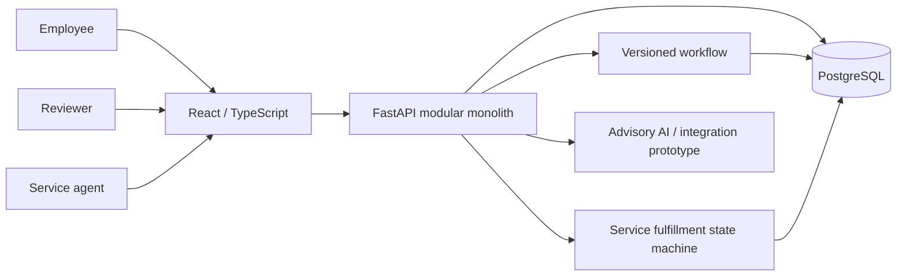

# CentralOps AI

**Governed employee requests from structured intake through human approval and service fulfillment.**


CentralOps AI is a portfolio-oriented internal service portal built as a modular
monolith. The verified governed path is now:

**catalog -> versioned private draft -> deterministic assigned approvals -> service
team queue -> assignment -> fulfillment -> requester timeline/audit**.

AI remains advisory. It never grants authorization, chooses final approval authority
or bypasses deterministic business rules.

## Current capability: M2-M5

An employee selects a published service, saves a typed private form and explicitly
submits it. The workflow resolves scoped human reviewers, preserves a snapshot of the
form/workflow version and records approve/reject/request-changes decisions. A final
approval creates exactly one work item for the snapshotted owner service team.

Authorized service staff then claim/receive the work, start it, optionally wait for
the requester, resume, resolve with an outcome and close it. Only closure marks the
request completed. M4 timeline/discussion/audit records the governed lifecycle.

Start with [M5 service fulfillment](docs/M5_SERVICE_FULFILLMENT.md),
[M4 activity/audit](docs/M4_ACTIVITY_AUDIT.md),
[M3 approvals](docs/M3_WORKFLOW_APPROVALS.md),
[M2 catalog/drafts](docs/M2_CATALOG_DRAFTS.md), and the canonical
[Project Progress](docs/PROJECT_PROGRESS.md).

| Area | Implemented | Boundary |
|---|---|---|
| Identity | Argon2, access JWT, rotating hashed refresh sessions, normalized roles | Secure cookies, stronger revocation/rate limits remain |
| Catalog | Published immutable form versions, typed renderer, private drafts | Attachments/advanced conditional form rules remain |
| Approval workflow | Sequential ALL steps; USER, MANAGER, ROLE, TEAM_LEAD resolvers; exact-assignee decisions | No conditional/ANY routing or delegation |
| Activity/audit | Request timeline, public discussion, internal notes, safe audit metadata and append-only guards | Not WORM/tamper-proof against a DB owner; retention policy remains |
| Fulfillment | Exactly-one work item after final approval, scoped queue, assignment, start/wait/resume/resolve/close | SLA-at-risk semantics and richer staffing UX remain |
| Data integrity | Transactions, row locks, optimistic versions, unique constraints and PostgreSQL race probes | CI races are not a load benchmark |
| AI prototype | Mock/Ollama/OpenAI-compatible legacy triage and lexical policy helper | Evaluated schema-aware AI intake and pgvector RAG remain planned |
| Power Platform assets | Connector/formula/flow specifications | Real Microsoft tenant evidence is not verified |

## Quick start - Windows + Docker

Requirements: Git and Docker Desktop with the Linux engine running.

```powershell
Set-Location "C:\AI_project\central-service-ai-automation"
git status --short
git fetch origin
git switch main
git pull --ff-only origin main
docker compose up -d --build --wait --wait-timeout 180
docker compose exec api alembic current
docker compose exec api python -m app.db.seed_catalog
docker compose exec api python -m app.db.seed_workflows
Invoke-RestMethod "http://localhost:8000/health"
Invoke-RestMethod "http://localhost:8000/ready"
Start-Process "http://localhost:3000"
```

M5 migration head: **`g8c2e5b7d934`**, following M4 `f7b1d4a6c823`.
Do not delete persistent volumes to switch schema versions. Back up development data
before migrations. Seed commands use synthetic local demo data and skip existing
catalog/workflow definitions.

### Demo accounts

| Role | Email | Local-only password |
|---|---|---|
| Requester | `employee@centralops.demo` | `Employee123!` |
| Direct manager | `manager.finance@centralops.demo` | `Manager123!` |
| Service lead / final reviewer | `service.lead@centralops.demo` | `ServiceLead123!` |
| Service agent | `service.agent@centralops.demo` | `ServiceAgent123!` |
| Prototype approver | `approver@centralops.demo` | `Approver123!` |
| Administrator | `admin@centralops.demo` | `Admin123!` |
| Read-only auditor | `auditor@centralops.demo` | `Auditor123!` |

Demo sequence:

1. Requester: **Service catalog -> Save draft -> Submit for approval**.
2. Manager then Service Lead: **Approvals -> Approve**.
3. Service Agent: open `http://localhost:3000/service-queue`, claim the queued work,
   start it, optionally wait/resume, resolve with a summary and close it.
4. Requester: open **Submitted requests** and inspect completed status/timeline.
5. Auditor/Admin: inspect **Audit log** metadata.

Web: `http://localhost:3000`  
Service queue: `http://localhost:3000/service-queue`  
API docs: `http://localhost:8000/docs`

Stop without deleting data:

```powershell
docker compose down
```

## Architecture



Stack: Python 3.12, FastAPI, SQLAlchemy 2, Alembic, Pydantic, React 19/TypeScript,
PostgreSQL 16, Docker Compose. SQLite is used for fast ordinary API tests; dedicated
PostgreSQL CI verifies lock/concurrency behavior. Redis and MinIO are provisioned but
notification delivery and attachment storage are later phases.

## Governed API entry points

All paths use `/api/v1` and authentication.

| Path | Purpose |
|---|---|
| `/auth/login`, `/auth/refresh`, `/auth/logout`, `/auth/me` | Session lifecycle |
| `/catalog/request-types` | Published catalog and ADMIN version configuration |
| `/requests/drafts` | Owner-only private drafts |
| `/workflows/definitions` | ADMIN workflow/version configuration |
| `/workflows/requests/{id}/submit` | Atomic submission from saved revision |
| `/workflows/requests` | Authorized submitted requests/history |
| `/workflows/approval-tasks` | Exact-assignee approval inbox |
| `/workflows/approval-tasks/{id}/decisions` | Version-checked human decision |
| `/activity/requests/{id}/...` | Scoped timeline/comments/permissions |
| `/audit/events` | ADMIN/AUDITOR metadata-only audit view |
| `/fulfillment/work-items` | Authorized team/unassigned/mine service queue |
| `/fulfillment/work-items/{id}/actions` | assign/start/wait/resume/resolve/close |

Legacy `/requests`, simple decision/status, request-context assistant and Power
Platform endpoints cannot mutate/expose the governed catalog/workflow path through
old authorization rules.

## Verification

M5 application checkpoint: **`05c264ba88ce8087865c930013d84bb1b3ffabb5`**.

- **CI #65 / 33971368204 SUCCESS:** Ruff, clean SQLite migration, **134 backend
  tests**, **83% coverage**, frontend TypeScript, ESLint, production build and tests.
- **PostgreSQL #38 / 33971368207 SUCCESS:** clean migration, M3 decision/submission
  races, M4 append-only/idempotency checks and M5 exactly-once queue/concurrent claim.
- **Browser #41 / 33971368246 SUCCESS:** production Docker + PostgreSQL + Chromium
  through M2/M3/M4 regressions and the complete M5 service lifecycle.

Browser/concurrency checks use disposable synthetic data with `CENTRALOPS_E2E=1`.
They are functional verification, not production certification or load testing.

Backend developer commands:

```bash
cd backend
uv sync --extra dev --python 3.12
uv run ruff check app tests
uv run pytest --cov=app --cov-report=term-missing
```

Frontend:

```bash
npm ci
npm run typecheck
npm run lint
npm run build
node --test tests/*.test.mjs
```

## AI and automation direction

The existing legacy adapter supports `mock`, `ollama` and `openai_compatible` modes,
but the governed workflow does not depend on model output for authorization or
approval. Phase 10 will add schema-aware editable AI intake; Phase 11 will add
permission-aware pgvector policy RAG with grounded citations and evaluation.

## Next milestones

Next is **Phase 8 attachments**: MinIO/S3-compatible object storage, authorized
presigned uploads, completion validation and short-lived authorized download URLs.
Then Phase 9 async notifications, Phase 10 AI intake and Phase 11 policy RAG.

The Phase 7 specification mentions an SLA-at-risk filter, but the roadmap defines
business-calendar SLA/escalation in Phase 13. M5 intentionally does not fabricate an
SLA policy; the model reserves `due_at` for that later governed definition.

Before shared production use: replace default secrets, add TLS/backups, secure-cookie
refresh transport, stronger access-token revocation/rate limiting, dependency
remediation, retention/redaction policy, broader security/failure/load testing and
real tenant/provider validation. No blanket enterprise-readiness claim is made.

## Reviewer resources

- [M5 service fulfillment guide](docs/M5_SERVICE_FULFILLMENT.md)
- [M4 activity and audit](docs/M4_ACTIVITY_AUDIT.md)
- [M3 workflow approvals](docs/M3_WORKFLOW_APPROVALS.md)
- [Canonical progress tracker](docs/PROJECT_PROGRESS.md)
- [Implementation status](docs/IMPLEMENTATION_STATUS.md)
- [Security and responsible AI](docs/security-and-responsible-ai.md)
- [DKSH alignment](docs/JD_ALIGNMENT_DKSH.md)

## License

[MIT](LICENSE) - retain the copyright and license notice when reusing the project.
