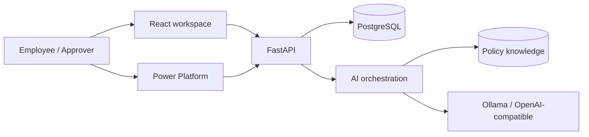

# CentralOps AI

**AI-assisted employee request, approval, and service operations platform.**


CentralOps AI turns an employee request into a traceable service workflow: structured
intake, AI triage, human approval, policy-grounded assistance, SLA monitoring, and
operational reporting. It is designed as a reusable portfolio project rather than a
company-specific prototype.

## Why this project exists

Internal requests often arrive through chat or email with incomplete context. Service teams
manually categorize them, find an approver, repeat policy answers, and assemble reports.
CentralOps centralizes that work while keeping AI in an advisory role.

## Product capabilities

| Area | What is implemented |
| --- | --- |
| Employee intake | Validated request form, reference, category, priority, status, and SLA target |
| AI triage | Category recommendation, priority recommendation, concise summary, confidence, provider and latency |
| LLM engineering | Mock, Ollama, and OpenAI-compatible providers with JSON parsing and deterministic fallback |
| Policy assistant | Grounded answers with article title, version, retrieval score, and request context |
| Human approval | Approver/admin role checks, approve/reject decision, comment, timestamp, and audit event |
| Operations | Request metrics, SLA compliance, AI coverage, automation success rate, and run history |
| Power Platform | Custom connector for Power Apps/Power Automate plus a flattened Power BI analytics feed |
| Quality | Eleven backend tests, frontend build/type checks, CI workflow, Docker health checks, UAT plan |

## Architecture



See [the detailed architecture](docs/architecture.md) for module boundaries, lifecycle,
provider strategy, and deployment profiles.

## Technology stack

- **Backend:** Python 3.11+, FastAPI, SQLAlchemy 2, Pydantic, JWT, Argon2, HTTPX.
- **Frontend:** React 19, TypeScript, responsive components, accessible dialogs and tables.
- **Data:** SQLite for zero-setup development; PostgreSQL 16 in Docker.
- **AI:** deterministic test provider, Ollama local models, or OpenAI-compatible endpoints.
- **Integration:** OpenAPI custom connector, Power Apps formulas, Power Automate flow spec,
  and Power BI model guidance.
- **Delivery:** Docker Compose, GitHub Actions, Ruff, Pytest, and reproducible lockfiles.

## Quick start with Docker

Requirements: Docker Desktop with Compose.

```bash
docker compose up --build
```

Open:

- Web workspace: `http://localhost:3000`
- FastAPI Swagger: `http://localhost:8000/docs`
- API health: `http://localhost:8000/health`

Stop the stack:

```bash
docker compose down
```

The default Docker profile uses the deterministic AI provider, so a reviewer does not need
an API key or GPU.

## Demo accounts

| Role | Email | Password |
| --- | --- | --- |
| Employee | `employee@centralops.demo` | `Employee123!` |
| Approver | `approver@centralops.demo` | `Approver123!` |
| Admin | `admin@centralops.demo` | `Admin123!` |

These accounts and passwords are local demo data. Never reuse them in a shared environment.

## Local development

### Backend

```bash
cd backend
cp ../.env.example .env
uv sync --extra dev
uv run uvicorn app.main:app --reload --port 8000
```

The default database is `backend/centralops.db`. Tables and synthetic demo records are
created on the first start.

### Frontend

In a second terminal:

```bash
npm ci
NEXT_PUBLIC_API_URL=http://localhost:8000/api/v1 npm run dev
```

When `NEXT_PUBLIC_API_URL` is absent, the frontend uses an interactive in-browser reviewer
demo. When it is present, users sign in and the workspace reads and writes the FastAPI API.

## Use a real LLM

### Ollama

```env
LLM_PROVIDER=ollama
LLM_MODEL=llama3.2:3b
LLM_BASE_URL=http://localhost:11434
```

### OpenAI-compatible endpoint

```env
LLM_PROVIDER=openai_compatible
LLM_MODEL=<model-name>
LLM_BASE_URL=https://<provider-host>
LLM_API_KEY=<secret>
```

Triage requests strict JSON. If an external provider times out or returns invalid output,
CentralOps records the fallback and completes classification using deterministic rules.

## Power Platform extension

The core product does not require a Microsoft tenant. Teams that use Microsoft 365 can add:

- Power Apps as another intake channel.
- Power Automate for approval and email orchestration.
- Power BI for service and SLA analysis.

Start with the [Power Platform integration guide](integrations/power-platform/README.md).
The directory includes the custom connector OpenAPI file, Canvas App formulas, an
environment-neutral flow specification, and Power BI measures.

## API surface

| Method | Route | Purpose |
| --- | --- | --- |
| `POST` | `/api/v1/auth/login` | Authenticate a demo user |
| `GET/POST` | `/api/v1/requests` | List or submit requests |
| `POST` | `/api/v1/requests/{id}/decision` | Human approval decision |
| `PATCH` | `/api/v1/requests/{id}/status` | Authorized lifecycle update |
| `POST` | `/api/v1/assistant/chat` | Grounded policy answer |
| `GET` | `/api/v1/analytics/summary` | Operational KPIs |
| `GET` | `/api/v1/automation/runs` | Workflow health and latency |
| `POST` | `/api/v1/integrations/power-platform/intake` | Power Apps/custom connector intake |
| `GET` | `/api/v1/integrations/power-platform/analytics-feed` | Power BI-friendly records |

Swagger documents the complete schemas and authorization requirements.

## Verification

```bash
cd backend
uv run ruff check app tests
uv run pytest --cov=app

cd ..
npm run typecheck
npm run lint
npm run build
```

Automated tests cover authentication, request validation, employee isolation, AI triage,
human approval, grounded citations, management analytics, and Power Platform intake.

## Repository structure

```text
central-service-ai-automation/
├── app/                          # React application surface
├── components/                   # Accessible UI primitives
├── lib/api.ts                    # Typed FastAPI client
├── backend/
│   ├── app/api/routes/           # FastAPI endpoints
│   ├── app/core/                 # Settings and security
│   ├── app/db/                   # Session and synthetic seed data
│   ├── app/models/               # SQLAlchemy entities
│   ├── app/services/             # LLM, retrieval, workflow logic
│   └── tests/                    # API and business-flow tests
├── integrations/power-platform/ # Custom connector and low-code assets
├── data/                         # Synthetic analytics sample
├── docs/                         # Architecture, security, UAT, reviewer and CV notes
├── .github/workflows/ci.yml      # Backend and frontend quality gates
└── docker-compose.yml            # Web, API, PostgreSQL, optional Ollama
```

## Responsible AI

- AI classifies and summarizes; a named human owns approval.
- Policy answers expose sources and versions.
- Synthetic data is used by default.
- Model failures are visible and recoverable.
- The production-hardening gaps are documented instead of hidden.

Read [security and responsible AI](docs/security-and-responsible-ai.md) before adapting the
project to real employee data.

## Reviewer resources

- [Three-minute reviewer walkthrough](docs/reviewer-walkthrough.md)
- [Prepared UAT and functional test plan](docs/uat-test-plan.md)
- [CV bullets and honest interview framing](docs/cv-and-interview-notes.md)

## Roadmap

- Hybrid vector + keyword retrieval with offline quality evaluation.
- SSO/OIDC and tenant-level authorization.
- Background worker and retry queue for notifications and long-running LLM calls.
- Versioned database migrations and OpenTelemetry traces.
- Imported Power Apps solution and Power Automate package from a test tenant.

## License

[MIT](LICENSE) - reuse is allowed with the copyright and license notice retained.
