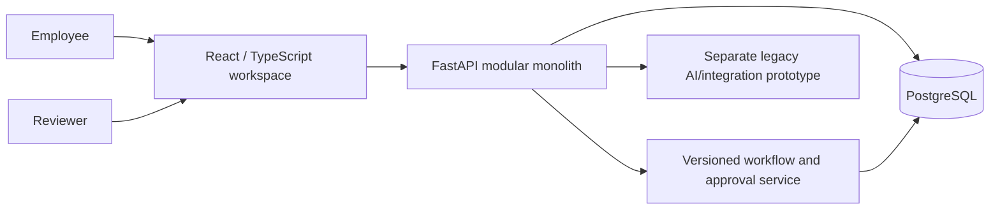

# CentralOps AI

**Employee requests, versioned forms and accountable human approval workflows.**


CentralOps AI is a portfolio-oriented internal service portal. The current governed
path is **catalog -> structured draft -> assigned sequential approvals**, with
version snapshots, concurrency protection and preserved revision history. AI stays
advisory; it does not grant authorization or make approval decisions.

## Current capability: M2 and M3

An employee selects a published service, saves a typed form and explicitly submits.
The workflow resolves the direct manager and service lead, gives each person an
assigned task in sequence, and records Approve, Reject or Request changes.
Resubmission restarts the chain as a new attempt while retaining old submitted
values and decisions. Unassigned administrators cannot approve someone else's task.

**Approved is not Completed.** Service work-item creation, fulfillment, the full
domain timeline/comments, attachments and asynchronous notifications are later
roadmap slices. This repository is not a production-security certification.

Start with [M3 demo and API guide](docs/M3_WORKFLOW_APPROVALS.md),
[M2 catalog/drafts](docs/M2_CATALOG_DRAFTS.md), the canonical
[Project Progress](docs/PROJECT_PROGRESS.md) and [Implementation Status](docs/IMPLEMENTATION_STATUS.md).
Original specifications remain in [`docs/project/`](docs/project/00_INDEX.md).

| Area | Implemented | Boundary |
|---|---|---|
| Identity | Argon2, access JWT, hashed rotating refresh sessions, normalized roles | Secure cookies, stronger session hardening and rate limits remain |
| Catalog | Immutable published form versions, typed renderer, private drafts, required-field validation | Attachments and advanced conditional rules are explicit unsupported cases |
| Workflow | Versioned sequential ALL steps; USER, MANAGER, ROLE and TEAM_LEAD resolvers | One default workflow per service; no conditional or ANY routing |
| Decisions | Exact-assignee inbox, revision checks, atomic actions and attempt history | No unassigned admin override; unavailable reviewer fails safely |
| Data integrity | SQL transactions, request locks, compare-and-swap, unique constraints | CI race probes are not a load benchmark |
| AI prototype | Mock/Ollama/OpenAI-compatible triage and lexical policy assistance | Evaluated schema-aware AI intake and pgvector RAG are still planned |
| Power Platform assets | OpenAPI connector, app formulas, flow specification and legacy analytics feed | Real Microsoft tenant evidence is not yet verified |

## Quick start on Windows / Docker

Requires Git and a running Docker Desktop Linux engine. Use a clean working tree:

```powershell
git fetch origin
git switch main
git pull --ff-only origin main
docker compose up -d --build --wait --wait-timeout 180
docker compose exec api alembic current
docker compose exec api python -m app.db.seed_catalog
docker compose exec api python -m app.db.seed_workflows
Start-Process "http://localhost:3000"
```

For the M3 release the migration head is `e6a0c3f5b712`. Existing data is preserved.
Catalog/workflow seed commands skip existing definitions; they do not overwrite
custom routing. Seeded credentials and rules are synthetic local demo data, not
DKSH policy. Never expose this default stack or its credentials publicly.

| Role in demo | Email | Local-only password |
|---|---|---|
| Requester | employee@centralops.demo | Employee123! |
| Direct manager | manager.finance@centralops.demo | Manager123! |
| Second reviewer | service.lead@centralops.demo | ServiceLead123! |
| Unassigned prototype approver | approver@centralops.demo | Approver123! |
| Administrator | admin@centralops.demo | Admin123! |

Use **Service catalog -> Save draft -> Submit for approval**, then switch to the
manager and service-lead accounts under **Approvals**. The generic approver has no
assigned task in this example. Try Request changes, edit under My drafts, resubmit
and inspect the earlier attempt under Submitted requests.

Web: `http://localhost:3000`. API docs: `http://localhost:8000/docs`.
Health/readiness: `/health`, `/ready`. The mock AI provider needs no key or GPU.

```powershell
docker compose ps
docker compose exec api alembic current
Invoke-RestMethod "http://localhost:8000/ready"
```

Stop without deleting data: `docker compose down`. Do not use `down -v` to fix an
old branch's migration mismatch. Back up persistent development data before schema
changes. Run Alembic inside the API container when checking its PostgreSQL data;
local development may target a different SQLite database.

## Architecture and stack



Python 3.12, FastAPI, SQLAlchemy 2, Alembic and Pydantic; React 19/TypeScript with
the existing vinext/Vite build tooling and Next-compatible app structure;
PostgreSQL 16 in Docker and SQLite for fast unit/API tests. Redis and MinIO are
provisioned infrastructure; workflow notifications/file storage are not active yet.

## API entry points

All domain paths use `/api/v1` and authentication.

| Path | Purpose |
|---|---|
| `/auth/login`, `/auth/refresh`, `/auth/logout`, `/auth/me` | Prototype session lifecycle |
| `/catalog/request-types` | Published service catalog and ADMIN version configuration |
| `/requests/drafts` | Owner-only save/read/update/validate draft |
| `/workflows/definitions` | ADMIN default workflow/version configuration |
| `/workflows/requests/{id}/submit` | Atomic submission using saved revision |
| `/workflows/requests` | Authorized submitted requests and immutable attempt details |
| `/workflows/approval-tasks` | Caller-specific pending/history inbox |
| `/workflows/approval-tasks/{id}/decisions` | Assigned decision using task version |

Earlier `/requests`, simple decision/status, `/assistant/chat` request context and
Power Platform paths are **legacy prototype** surfaces. They cannot mutate or
expose catalog-based workflows through the old authorization path. Legacy dashboard
metrics and illustrative charts are not presented as measured M3 operational KPIs.

## Development and verification

Backend:

```bash
cd backend
uv sync --extra dev --python 3.12
uv run ruff check app tests
uv run pytest --cov=app --cov-report=term-missing
```

Frontend in a consistent Linux/Node 22 environment:

```bash
npm ci
npm run typecheck
npm run lint
npm run build
node --test tests/*.test.mjs
```

Windows users can use Docker to avoid mixing Windows dependencies with an
unconfigured WSL Node installation. The `NEXT_PUBLIC_API_URL` build argument in
Compose connects the real API. Without that variable the frontend is an illustrative
reviewer demo; it does not persist drafts or exercise the real workflow.

GitHub CI verifies backend tests, clean SQLite migration, frontend typecheck/lint/
build/tests. A separate PostgreSQL job runs clean migrations and independent-
connection races: repeated submission, repeated intermediate/final decisions and
two different ALL reviewers. Browser smoke runs Chromium against production Docker
images through private drafts, revision/resubmission and final human approval.
Current recorded baseline: **107 backend tests, 85% total statement coverage**.
See the tracker and PR #11 for exact tested commits and workflow run IDs.

Browser/concurrency probes require `CENTRALOPS_E2E=1` and disposable data; they must
not run on production. Artifacts are synthetic screenshots, not token-bearing traces.

## AI and automation direction

The legacy AI adapter supports `mock`, `ollama` and `openai_compatible` providers.
Environment keys are documented in `.env.example` and
[architecture](docs/architecture.md). These adapters do not authorize or route the
new governed workflow. CI uses `mock`; no real-model accuracy or latency is claimed.

The later AI Intake Assistant will use the published catalog and form validator to
classify intent, extract editable values and ask for missing fields before the user
confirms submission. Policy RAG will add ingestion, embeddings, pgvector and
permission-aware grounded citations. Neither milestone is declared complete merely
because a chat screen exists.

[Power Platform integration assets](integrations/power-platform/README.md),
[DKSH JD alignment](docs/JD_ALIGNMENT_DKSH.md) and the
[data quality exercise](scripts/clean_service_requests.py) support the automation
internship track. A functioning Microsoft tenant workflow and Power BI report must
be demonstrated separately before being claimed on a CV.

## Next milestones and known risks

Next is Phase 6 / M4: full request timeline, comments and protected internal notes.
Then Phase 7 / M5 fulfillment, Phase 8 attachments, Phase 9 notifications, followed
by Phase 10 AI intake and Phase 11 evaluated policy RAG. Original ordered plan:
[07_IMPLEMENTATION_PLAN.md](docs/project/07_IMPLEMENTATION_PLAN.md).

Before shared production use: remediate dependency audit findings, replace default
secrets, configure TLS/backups, move refresh transport to secure cookies, review
session revocation/rate limiting and perform broader security/load testing. Current
refresh logout does not revoke every already-issued access JWT. No blanket security
or enterprise-readiness claim is made.

## Reviewer resources

- [Current M3 demo and API guide](docs/M3_WORKFLOW_APPROVALS.md)
- [Canonical progress tracker](docs/PROJECT_PROGRESS.md)
- [Security and responsible AI](docs/security-and-responsible-ai.md)
- [Prepared UAT plan](docs/uat-test-plan.md)
- [Earlier reviewer walkthrough](docs/reviewer-walkthrough.md) and [CV framing](docs/cv-and-interview-notes.md) describe the original prototype; prefer the M3 guide for the new flow.

## License

[MIT](LICENSE) - retain the copyright and license notice when reusing the project.
