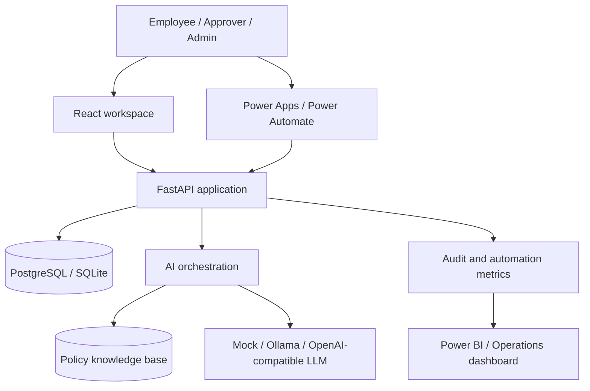
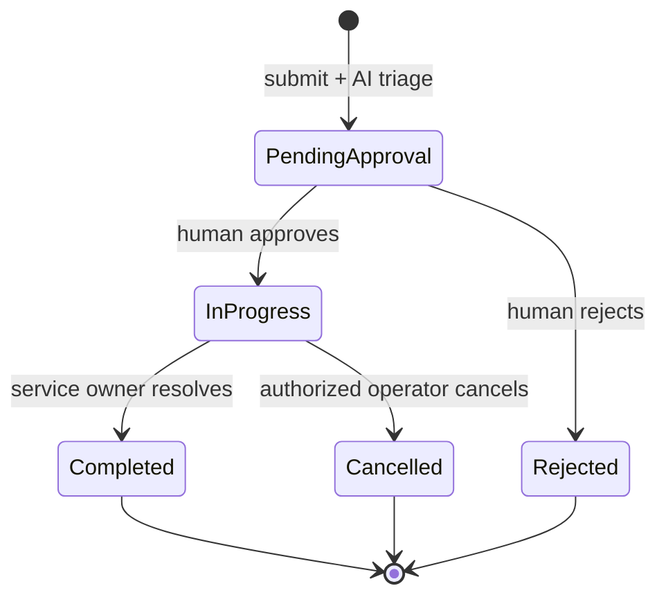

# Architecture

CentralOps AI uses a modular monorepo so the product can run as a conventional
React/FastAPI application while exposing optional Microsoft Power Platform channels.

## Backend boundaries

| Module | Responsibility |
| --- | --- |
| `api/routes` | HTTP contracts, authentication dependencies, role checks |
| `services/workflow.py` | Request lifecycle, SLA target, audit events |
| `services/llm.py` | Provider abstraction, triage prompt, parsing, safe fallback |
| `services/retrieval.py` | Deterministic policy retrieval and citation scoring |
| `models` | Persistent users, requests, approvals, policies, audit and run history |
| `integrations` | API-key-protected Power Platform surface |

## Request lifecycle

AI is advisory. It recommends category, priority, and a summary, but it cannot
approve a request or grant access.

## LLM provider strategy

The same service interface supports:

- `mock`: deterministic offline behavior for tests and reviewer demos.
- `ollama`: local models through `/api/chat`.
- `openai_compatible`: hosted or self-hosted OpenAI-compatible chat endpoints.

Every external-provider failure falls back to deterministic triage. The provider,
model, duration, and fallback status are recorded for operational review.

## Deployment profiles

- Local development: SQLite, mock LLM, two local development servers.
- Docker demo: PostgreSQL, FastAPI, React, optional Ollama.
- Enterprise path: managed PostgreSQL, reverse proxy, secret manager, SSO/OIDC,
  worker queue, centralized logs, and managed LLM endpoint.

The repository deliberately does not claim the demo profile is production-ready.
The architecture separates the areas that would need production hardening.
