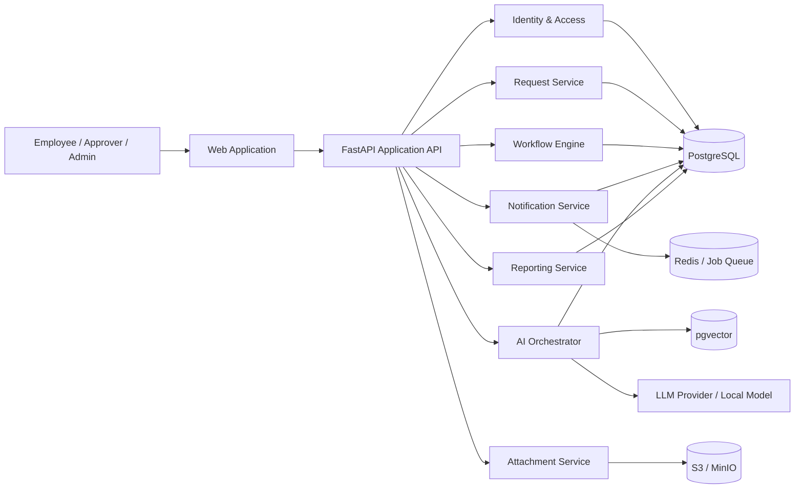

# Central Service AI Automation – Employee Request & Approval System

## 1. Project overview

**Central Service AI Automation** is an internal enterprise service platform that allows employees to submit operational requests through one central portal instead of relying on email, chat messages, spreadsheets, and informal approvals.

The system standardizes request intake, automatically determines the correct approval workflow, tracks progress and service-level commitments, notifies the right stakeholders, records a complete audit trail, and uses AI to reduce repetitive coordination work.

Typical request categories include:

- IT equipment and access requests.
- Software/license requests.
- Leave, overtime, and work-from-home requests.
- Procurement and reimbursement requests.
- Facilities and maintenance requests.
- HR document requests.
- Business travel requests.
- Security/access-control requests.
- General internal service requests.

The project is designed to begin as a focused MVP and evolve toward a reusable enterprise workflow platform.

---

## 2. Problem being solved

In many teams, internal requests are fragmented across email, Slack/Teams, spreadsheets, private chats, and verbal approval. This creates common operational problems:

1. Employees do not know where to submit a request.
2. Required information is often missing, causing repeated back-and-forth.
3. Requests are sent to the wrong person or department.
4. Approval status is unclear.
5. Managers have no single view of pending approvals.
6. Service teams have difficulty prioritizing work.
7. SLA breaches are detected too late.
8. Policy questions repeatedly consume HR/IT/operations time.
9. Decision history is difficult to audit.
10. Management cannot easily measure request volume, bottlenecks, turnaround time, or workload.

Central Service AI addresses these problems with a single intake layer, configurable workflows, structured data, automation, and AI-assisted interaction.

---

## 3. Core value proposition

### For employees

- One place to submit all internal requests.
- Natural-language request creation instead of searching through many forms.
- Clear status, approver, timeline, and next action.
- Faster resolution because required information is validated before submission.

### For managers and approvers

- Central approval inbox.
- Concise AI-generated request summaries.
- Approve, reject, or request changes with context.
- Escalation and delegation support.

### For service teams

- Structured queue instead of unstructured emails.
- Automatic assignment and routing.
- Priority and SLA visibility.
- Internal notes, attachments, and full request history.

### For administrators and management

- Configurable request types and approval rules.
- Role-based access control.
- Audit-ready activity history.
- Analytics for workload, approval delays, SLA, and common request categories.

---

## 4. What the application can do

### 4.1 Identity and organization

- User login and logout.
- Employee profile.
- Department/team membership.
- Manager relationship.
- Roles and permissions.
- Optional enterprise SSO in production.

### 4.2 Request catalog

- Browse available service/request types.
- Search by keyword, department, and category.
- Dynamic forms per request type.
- Conditional fields.
- Required-field validation.
- File attachments.

### 4.3 AI request assistant

The AI assistant is not the decision-maker. It acts as an **intake and productivity copilot**.

It can:

- Classify a natural-language request into a request type.
- Extract structured fields from text.
- Detect missing information.
- Ask targeted clarification questions.
- Suggest priority based on configured rules.
- Summarize long descriptions.
- Recommend relevant policy documents.
- Explain why a request requires a certain approval step.
- Draft a request for user review.

A human remains responsible for final submission and approval decisions.

### 4.4 Workflow and approval engine

- Resolve a workflow after submission.
- Support one-step and multi-step approval.
- Support sequential steps.
- Support parallel approvers.
- Support “any one” or “all must approve” logic.
- Determine approver from manager, department, role, or explicit user.
- Reject request.
- Request changes.
- Re-submit changed requests.
- Delegate approval.
- Escalate overdue approval.
- Cancel request when policy allows.

### 4.5 Service fulfillment

After approval, a request can become a service task:

- Assign to service team or service agent.
- Mark acknowledged/in progress/waiting/completed.
- Add internal notes.
- Request information from employee.
- Track target due date and SLA.
- Record final resolution.

### 4.6 Notifications

- In-app notifications.
- Email notifications.
- Optional Slack/Teams integration later.
- Notification events for submission, assignment, approval, rejection, clarification, escalation, completion, and SLA risk.

### 4.7 Audit and compliance

- Immutable-style request event history.
- Track who changed what and when.
- Store previous and new values for sensitive changes.
- Record approval reasons.
- Record AI runs separately from human decisions.

### 4.8 Analytics

- Requests by category.
- Requests by department.
- Average resolution time.
- Average approval time.
- SLA compliance rate.
- Pending approvals by manager.
- Rejection rate.
- Bottleneck stages.
- Service-team workload.

---

## 5. Main user roles

| Role | Main responsibility |
|---|---|
| Employee | Create requests, provide information, follow progress, respond to clarification |
| Approver | Review and decide assigned approval tasks |
| Manager | Approver responsibilities plus team request visibility |
| Service Agent | Fulfill approved service requests |
| Service Lead | Manage queue, assignment, SLA, and team workload |
| Admin | Configure request types, workflows, roles, policies, integrations |
| Auditor | Read-only access to authorized audit and historical data |

Permissions should be implemented using **RBAC** with contextual rules where necessary.

---

## 6. High-level modules

---

## 7. Product principles

### 7.1 Human-in-the-loop by default

AI may recommend, classify, summarize, and draft. It should not silently approve financial, access-control, HR-sensitive, or security-sensitive requests.

### 7.2 Configurable instead of hard-coded

Request types, fields, approval rules, SLA targets, and notification rules should be data-driven where practical.

### 7.3 Auditability over “magic”

Every important automation should be explainable:

- Which workflow was selected?
- Which rule matched?
- Who approved?
- What was the AI recommendation?
- What final action was taken by a human?

### 7.4 Modular monolith first

The MVP should use a **modular monolith**, not premature microservices. Domains remain separated in code so they can be extracted later if scale demands it.

### 7.5 Production-oriented portfolio project

The project should demonstrate more than a CRUD dashboard. It should show:

- authentication,
- authorization,
- relational database design,
- background processing,
- workflow/state management,
- AI integration,
- testing,
- auditability,
- deployment,
- observability,
- system design trade-offs.

---

## 8. MVP scope

The first release should include:

1. Login and basic user/department data.
2. Employee dashboard.
3. Request catalog.
4. Dynamic request form.
5. AI-assisted request drafting.
6. Request submission.
7. Configurable sequential approval workflow.
8. Manager approval inbox.
9. Approve/reject/request changes.
10. Request timeline.
11. Service-agent queue.
12. Basic in-app/email notifications.
13. Admin request-type and workflow configuration.
14. Audit log.
15. Basic analytics dashboard.

Do **not** make the first MVP dependent on complex enterprise integrations such as SAP, Workday, ServiceNow, or Microsoft Entra. Build clean adapters so these can be added later.

---

## 9. Non-functional goals

### Security

- Strong password hashing for local accounts.
- Short-lived access sessions/tokens.
- Refresh-token rotation when local auth is used.
- Role and resource-level permission checks.
- Attachment validation.
- Rate limiting on authentication and AI endpoints.
- Secrets stored outside source control.
- Audit logs for sensitive actions.

### Reliability

- Database transactions for workflow transitions.
- Idempotent background jobs where possible.
- Retries with backoff for email/AI/integration calls.
- Health and readiness endpoints.

### Performance

Initial target for normal business operations:

- Common API read operations: typically under ~300 ms server-side excluding network.
- Request submission: typically under ~1 s excluding optional asynchronous AI work.
- AI interactions: streamed or visibly progressive so the UI remains responsive.

These are engineering targets, not contractual SLAs.

### Maintainability

- Typed schemas.
- Automated migrations.
- Clear domain boundaries.
- OpenAPI documentation.
- Unit and integration tests.
- CI checks.

---

## 10. Development direction

### Stage 1 — Strong portfolio MVP

Focus on one complete request lifecycle with excellent engineering quality.

### Stage 2 — Enterprise-ready workflow features

Add:

- parallel approvals,
- delegation,
- escalation,
- schedule/absence awareness,
- richer workflow rule builder,
- approval thresholds,
- service-team routing.

### Stage 3 — AI knowledge and automation

Add:

- policy RAG,
- confidence scores,
- AI-generated summaries,
- policy-grounded explanations,
- duplicate request detection,
- recommended resolution steps,
- SLA-risk prediction.

### Stage 4 — Integrations

Potential adapters:

- Microsoft Entra ID / Google Workspace SSO.
- Microsoft Teams / Slack.
- Email.
- Jira.
- ServiceNow.
- HRIS.
- ERP/procurement systems.

### Stage 5 — Platformization

Turn the product into a reusable internal workflow platform:

- no-code form builder,
- workflow builder,
- custom policy engine,
- integration marketplace,
- organization-level reporting,
- multi-tenant support if commercialization becomes a goal.

---

## 11. Suggested project positioning for GitHub/CV

**One-line GitHub description:**

> AI-assisted employee service portal with configurable approval workflows, RBAC, SLA tracking, RAG-based policy support, audit logs, and production-oriented FastAPI/Next.js architecture.

**CV-style description:**

> Built an AI-assisted internal service and approval platform that converts natural-language employee requests into structured workflows, dynamically routes multi-stage approvals, tracks SLA and audit history, and provides policy-grounded AI assistance using FastAPI, Next.js, PostgreSQL/pgvector, Redis, and containerized deployment.

---

## 12. Definition of success

The project is successful when a new user can complete this sequence without developer assistance:

1. Log in.
2. Describe or select a request.
3. Provide required details.
4. Submit.
5. Automatically route to the correct approver.
6. Approver reviews and makes a decision.
7. Service agent receives approved work.
8. Employee sees status and history.
9. Admin can audit the full lifecycle.
10. Dashboard metrics reflect the completed request.

That complete vertical slice should be prioritized before adding many extra request types.
