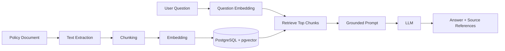
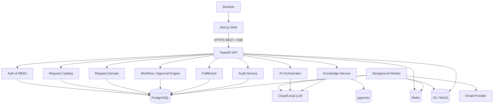

# Technical Architecture & Engineering Decisions

## 1. Architecture strategy

Use a **modular monolith** for the first production-capable version.

Why:

- The business domains are related and share transactional workflows.
- A single deployment is much easier to build, test, and demo.
- Database transactions are straightforward.
- The code can still be separated into bounded modules.
- Microservices can be extracted only when there is a proven scaling or team-boundary requirement.

Recommended deployment units for MVP:

1. `web` — Next.js frontend.
2. `api` — FastAPI application.
3. `worker` — background task worker using the same domain packages as the API.
4. `postgres` — PostgreSQL + pgvector.
5. `redis` — cache/task broker.
6. `minio` — local S3-compatible object storage for development.

---

## 2. Recommended technology stack

| Layer | Choice | Why |
|---|---|---|
| Frontend | Next.js + TypeScript | Mature React framework, routing, server/client rendering, strong ecosystem |
| UI styling | Tailwind CSS | Fast, consistent implementation of design system |
| UI components | shadcn/ui + Radix primitives | Accessible and customizable enterprise UI building blocks |
| Server state | TanStack Query | Fetching, caching, mutations, invalidation |
| Forms | React Hook Form + Zod | Dynamic forms, validation, type-safe client schemas |
| Backend | FastAPI | Excellent Python API framework, async support, OpenAPI, strong fit with AI workloads |
| Validation | Pydantic | Typed request/response/domain schemas |
| ORM | SQLAlchemy | Mature relational data access and explicit transaction control |
| Migrations | Alembic | Versioned database migrations |
| Database | PostgreSQL | Strong relational semantics, JSONB, indexing, mature ecosystem |
| Vector search | pgvector | Keeps policy embeddings inside PostgreSQL for an MVP |
| Cache / broker | Redis | Queue broker, short-lived cache, rate-limit support |
| Background jobs | Celery or Dramatiq | Email, AI ingestion, embeddings, document processing, retries |
| Object storage | S3-compatible storage; MinIO locally | Durable attachment storage without putting binaries in DB |
| Auth | Local JWT/session implementation for demo; OIDC adapter for production | Portfolio-friendly now, enterprise-ready later |
| AI orchestration | Provider adapter + structured outputs/tool calling | Avoid hard-coupling business logic to one model vendor |
| Local LLM option | Ollama | Offline/local demo path |
| API docs | OpenAPI generated by FastAPI | Testable contract and easy frontend integration |
| Containers | Docker + Docker Compose | Reproducible local/demo environment |
| Reverse proxy | Nginx or Caddy | TLS termination/routing in deployment |
| CI | GitHub Actions | Lint, tests, build, migration checks |
| Observability | OpenTelemetry + structured logs; optional Sentry/Grafana | Production debugging and latency/error insight |

Use current stable/LTS releases at implementation time rather than pinning this architecture document to a quickly aging version number.

---

## 3. Frontend architecture

Recommended structure:

```text
apps/web/
├── app/
│   ├── (auth)/
│   ├── (dashboard)/
│   │   ├── requests/
│   │   ├── approvals/
│   │   ├── service-desk/
│   │   ├── knowledge/
│   │   ├── analytics/
│   │   └── admin/
│   └── api/                 # only frontend-specific route handlers if needed
├── components/
│   ├── ui/
│   ├── forms/
│   ├── requests/
│   ├── approvals/
│   └── layout/
├── features/
│   ├── auth/
│   ├── requests/
│   ├── workflows/
│   ├── notifications/
│   └── ai-assistant/
├── lib/
│   ├── api-client.ts
│   ├── auth.ts
│   └── permissions.ts
├── hooks/
└── types/
```

### Frontend principles

- Server is source of truth for permissions.
- Frontend permission checks are UX optimizations only.
- Use generated or shared types from OpenAPI where practical.
- Keep AI conversation state separate from final request form state.
- Do not make the UI depend on raw internal database status names.

---

## 4. Backend architecture

Recommended domain modules:

```text
apps/api/app/
├── main.py
├── core/
│   ├── config.py
│   ├── security.py
│   ├── database.py
│   ├── logging.py
│   ├── exceptions.py
│   └── middleware.py
├── modules/
│   ├── auth/
│   ├── users/
│   ├── organization/
│   ├── requests/
│   ├── catalog/
│   ├── workflows/
│   ├── approvals/
│   ├── fulfillment/
│   ├── comments/
│   ├── attachments/
│   ├── notifications/
│   ├── knowledge/
│   ├── ai/
│   ├── analytics/
│   └── audit/
├── shared/
│   ├── enums.py
│   ├── pagination.py
│   ├── events.py
│   └── permissions.py
└── tests/
```

Each module can contain:

```text
router.py        # HTTP endpoints
schemas.py       # Pydantic request/response schemas
models.py        # SQLAlchemy models
service.py       # application/domain use cases
repository.py    # database queries
permissions.py   # domain authorization rules
events.py        # domain event definitions
```

Avoid forcing every module into this exact shape if it creates empty boilerplate.

---

## 5. API design

Base path:

```text
/api/v1
```

### Authentication

```http
POST   /api/v1/auth/login
POST   /api/v1/auth/refresh
POST   /api/v1/auth/logout
GET    /api/v1/auth/me
```

### Users and organization

```http
GET    /api/v1/users
GET    /api/v1/users/{user_id}
GET    /api/v1/departments
GET    /api/v1/teams
```

### Request catalog

```http
GET    /api/v1/request-types
GET    /api/v1/request-types/{type_id}
POST   /api/v1/admin/request-types
PATCH  /api/v1/admin/request-types/{type_id}
POST   /api/v1/admin/request-types/{type_id}/publish
```

### Employee requests

```http
POST   /api/v1/requests
GET    /api/v1/requests
GET    /api/v1/requests/{request_id}
PATCH  /api/v1/requests/{request_id}
POST   /api/v1/requests/{request_id}/submit
POST   /api/v1/requests/{request_id}/cancel
POST   /api/v1/requests/{request_id}/reply
GET    /api/v1/requests/{request_id}/timeline
```

### Approvals

```http
GET    /api/v1/approvals/inbox
GET    /api/v1/approvals/{approval_id}
POST   /api/v1/approvals/{approval_id}/approve
POST   /api/v1/approvals/{approval_id}/reject
POST   /api/v1/approvals/{approval_id}/request-changes
POST   /api/v1/approvals/{approval_id}/delegate
```

### Fulfillment

```http
GET    /api/v1/service-requests
POST   /api/v1/service-requests/{request_id}/assign
POST   /api/v1/service-requests/{request_id}/start
POST   /api/v1/service-requests/{request_id}/wait-for-requester
POST   /api/v1/service-requests/{request_id}/resolve
POST   /api/v1/service-requests/{request_id}/close
```

### Comments and attachments

```http
POST   /api/v1/requests/{request_id}/comments
GET    /api/v1/requests/{request_id}/comments
POST   /api/v1/requests/{request_id}/attachments/presign
POST   /api/v1/requests/{request_id}/attachments/complete
```

### AI

```http
POST   /api/v1/ai/intake/classify
POST   /api/v1/ai/intake/extract
POST   /api/v1/ai/intake/clarify
POST   /api/v1/ai/requests/{request_id}/summarize
POST   /api/v1/ai/knowledge/ask
```

For a polished UX, AI endpoints can support Server-Sent Events for streamed text where appropriate.

### Admin workflows

```http
GET    /api/v1/admin/workflows
POST   /api/v1/admin/workflows
GET    /api/v1/admin/workflows/{workflow_id}
PATCH  /api/v1/admin/workflows/{workflow_id}
POST   /api/v1/admin/workflows/{workflow_id}/publish
```

### Analytics

```http
GET    /api/v1/analytics/summary
GET    /api/v1/analytics/requests-by-type
GET    /api/v1/analytics/sla
GET    /api/v1/analytics/approval-time
```

---

## 6. Workflow engine decision

### MVP choice: custom state-machine/domain engine

Do not introduce Temporal/Camunda/BPMN on day one.

Implement a deterministic workflow engine with:

- workflow definitions,
- versioning,
- trigger conditions,
- workflow steps,
- approver resolver,
- step state,
- transition service,
- due dates,
- audit events.

### Why not a large workflow platform initially?

- It adds deployment and conceptual complexity.
- Most MVP workflows are simple sequential approval chains.
- The domain behavior is easier to demonstrate when owned in the application.

### When to migrate

Consider Temporal/Camunda only when you need:

- long-running cross-system orchestration,
- complex retries/compensation,
- hundreds of workflow templates,
- visual BPMN governance,
- large engineering teams independently deploying workflow components.

---

## 7. Workflow execution model

On request submission:

1. Validate request form against the published request-type schema.
2. Select the active workflow version.
3. Evaluate deterministic conditions.
4. Create a `workflow_instance` snapshot.
5. Resolve first approver(s).
6. Create approval tasks.
7. Persist request + workflow + event atomically.
8. Commit transaction.
9. Publish/queue notification event.

On approval:

1. Lock/check approval task state.
2. Verify actor permission.
3. Save decision and comment.
4. Append audit/request event.
5. Determine whether current step is complete.
6. If complete, activate next workflow step.
7. If final step is complete, mark approval lifecycle approved and create/queue fulfillment work.
8. Commit transaction.
9. Trigger asynchronous notifications.

Use database transactions and optimistic/pessimistic locking as needed to prevent double decisions.

---

## 8. AI architecture

### 8.1 AI responsibilities

AI is allowed to:

- classify,
- extract,
- summarize,
- retrieve policy,
- propose structured values,
- explain.

AI is not the source of truth for:

- authorization,
- approval routing,
- final policy enforcement,
- financial calculations that must be exact,
- final approval decisions.

### 8.2 Provider abstraction

Define an application interface similar to:

```python
class LLMProvider:
    async def structured_generate(self, *, messages, schema, context): ...
    async def embed(self, texts: list[str]) -> list[list[float]]: ...
```

Implement adapters such as:

- cloud LLM provider adapter,
- OpenAI-compatible provider adapter,
- Ollama/local adapter.

The rest of the application calls the interface, not vendor-specific SDK code.

### 8.3 Structured AI output

Classification/extraction should return validated data, for example:

```json
{
  "request_type_code": "IT_HARDWARE",
  "confidence": 0.93,
  "fields": {
    "reason": "Current laptop frequently shuts down",
    "business_impact": "Client work is interrupted"
  },
  "missing_required_fields": ["cost_center"],
  "needs_human_confirmation": true
}
```

Always validate model output using Pydantic before it enters business logic.

### 8.4 RAG pipeline



Metadata should include:

- document id,
- document version,
- title,
- department,
- effective date,
- page/section when available,
- access scope.

Retrieval must respect access permissions before chunks are sent to the model.

---

## 9. Authentication architecture

### MVP/local development

- Email + password.
- Argon2id password hashing.
- Short-lived access token or secure server session.
- Rotating refresh token stored as an HttpOnly, Secure, SameSite cookie.
- Store only hashed refresh-token identifiers/server-side token records.

### Production enterprise option

OIDC/OAuth2 with an identity provider such as Microsoft Entra ID, Okta, or Google Workspace.

Internal DB still stores:

- application user id,
- external subject id,
- department/team mapping,
- manager relationship,
- application roles,
- active state.

Do not make authorization depend only on identity-provider groups; map them into the application’s permission model.

---

## 10. Authorization model

### RBAC roles

- EMPLOYEE
- APPROVER
- MANAGER
- SERVICE_AGENT
- SERVICE_LEAD
- ADMIN
- AUDITOR

### Contextual rules

Examples:

- employee can read own request,
- manager may read team requests when policy permits,
- assigned approver can read protected approval context,
- service agent can update requests belonging to their service queue,
- admin can configure workflows,
- auditor is read-only.

Implement permission checks in service/use-case layer, not only endpoint decorators.

---

## 11. Database strategy

Use PostgreSQL for transactional data and pgvector for semantic search.

Important patterns:

- UUID primary keys.
- `created_at`, `updated_at` timestamps.
- soft deactivation rather than deleting important organizational records.
- JSONB for dynamic request values and rule configuration.
- normalized relational tables for identity, workflow execution, approvals, comments, audit logs.
- indexed foreign keys.
- partial indexes for common active/pending queues when useful.

Do not store attachment binaries inside PostgreSQL.

---

## 12. Background jobs

Use worker jobs for:

- email delivery,
- document extraction,
- embedding generation,
- scheduled escalation,
- SLA warning notifications,
- integration webhooks,
- analytics materialization if later needed.

A job should contain an idempotency key where duplication could cause harm.

---

## 13. Notifications architecture

Business transaction writes notification intent/event first; delivery happens asynchronously.

```text
Domain action
  -> request event persisted
  -> notification job queued
  -> worker loads template
  -> worker sends email/in-app/connector message
  -> delivery status recorded
```

Do not hold an approval HTTP request open while waiting for email delivery.

---

## 14. Realtime strategy

For MVP, use one of:

- Server-Sent Events for live notification feed, or
- WebSocket for bidirectional live UI.

Realtime is not required for core correctness. The UI must remain correct with normal polling/refetching.

---

## 15. Attachment storage

Recommended flow:

1. Frontend requests upload authorization.
2. Backend checks request permission and file constraints.
3. Backend returns pre-signed upload URL.
4. Browser uploads directly to object storage.
5. Browser calls `complete` endpoint.
6. Backend validates metadata and creates attachment record.

Security controls:

- file-size limit,
- allowlisted MIME types,
- generated storage keys,
- malware scan hook in production,
- private buckets,
- short-lived signed download URLs.

---

## 16. Security decisions

- HTTPS in production.
- Secure cookies.
- CSRF protection when cookie-based auth requires it.
- CORS restricted to known frontend origins.
- Rate limiting for login and AI endpoints.
- Input validation on all APIs.
- Parameterized SQL through ORM/query builder.
- Central secret management.
- Audit logs for privileged actions.
- Redact secrets/PII from logs.
- Do not place raw policy documents or private request data in third-party AI requests unless allowed by deployment policy.

---

## 17. Observability

### Logging

Use structured JSON logs containing:

- timestamp,
- level,
- request_id/correlation_id,
- actor_id where appropriate,
- route,
- duration,
- status_code,
- domain event type.

Never log passwords, tokens, or full sensitive form values.

### Metrics

Track:

- API latency,
- error rate,
- DB query latency,
- queue depth,
- job failure rate,
- AI latency,
- AI token/cost usage if cloud provider is used,
- workflow transitions,
- notification failures.

### Tracing

OpenTelemetry is a good foundation for tracing API → DB → queue → external AI calls.

---

## 18. Testing strategy

### Backend

- Unit tests for workflow rules.
- Unit tests for permission functions.
- Integration tests with PostgreSQL.
- API tests for request lifecycle.
- Concurrency test for double approval.
- AI adapter mocked in deterministic tests.

### Frontend

- Component tests for dynamic form renderer.
- Feature tests for submit/approve flows.
- End-to-end tests using Playwright for key journeys.

### Security-focused tests

- requester cannot access another unauthorized request,
- employee cannot invoke approval endpoint,
- service agent cannot alter workflow decisions,
- deactivated user cannot authenticate,
- attachment URLs cannot be accessed without permission.

---

## 19. CI/CD

Suggested GitHub Actions pipeline:

```text
Pull Request
├── backend lint
├── backend type/static checks
├── backend tests
├── frontend lint
├── frontend typecheck
├── frontend tests
├── build frontend
├── build backend image
└── migration consistency check
```

Main branch:

```text
CI passes
-> build tagged images
-> push image registry
-> deploy staging
-> run smoke tests
-> manual/controlled production promotion
```

---

## 20. Local Docker topology

```yaml
services:
  web:
  api:
  worker:
  postgres:
  redis:
  minio:
```

Optional local AI:

```text
Ollama running on host or as a separate container
```

Use `.env.example` with placeholder values and never commit real credentials.

---

## 21. Architecture trade-offs

### PostgreSQL + pgvector vs separate vector DB

Choose pgvector first because:

- smaller operational footprint,
- enough for internal policy knowledge at MVP scale,
- easier transactional metadata filtering.

Move to a dedicated vector/search service only if scale or search capability requires it.

### JSONB dynamic fields vs one table per request type

Use a hybrid approach:

- common request metadata in relational columns,
- dynamic form answers in JSONB,
- important workflow values optionally copied into typed/indexed fields or normalized tables.

This provides flexibility without creating hundreds of tables.

### Monolith vs microservices

Use modular monolith first. Split only for proven operational reasons.

---

## 22. Recommended architecture diagram


