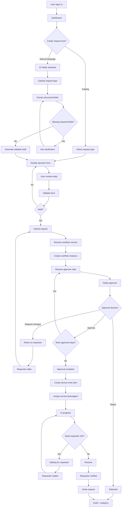
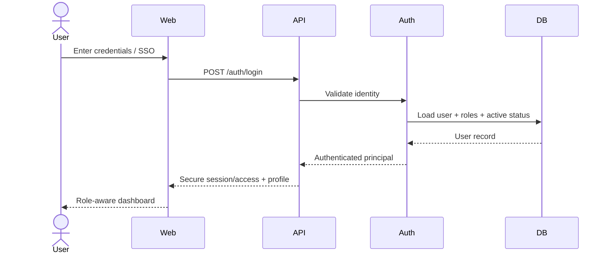
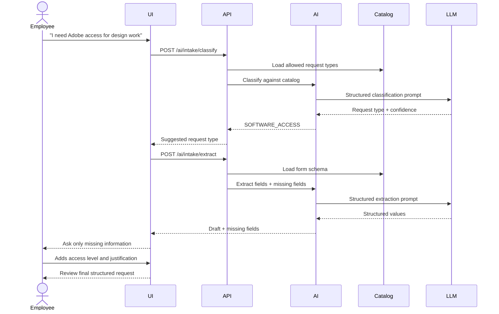
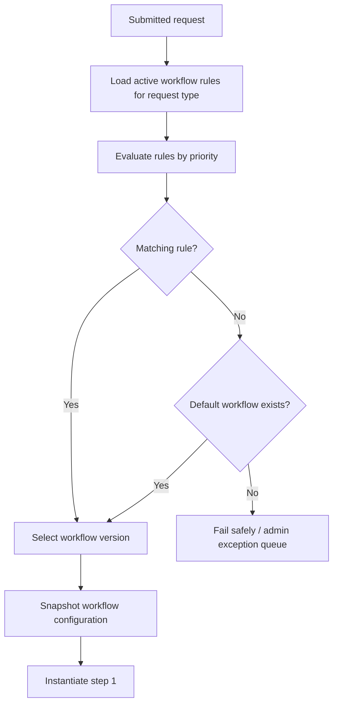
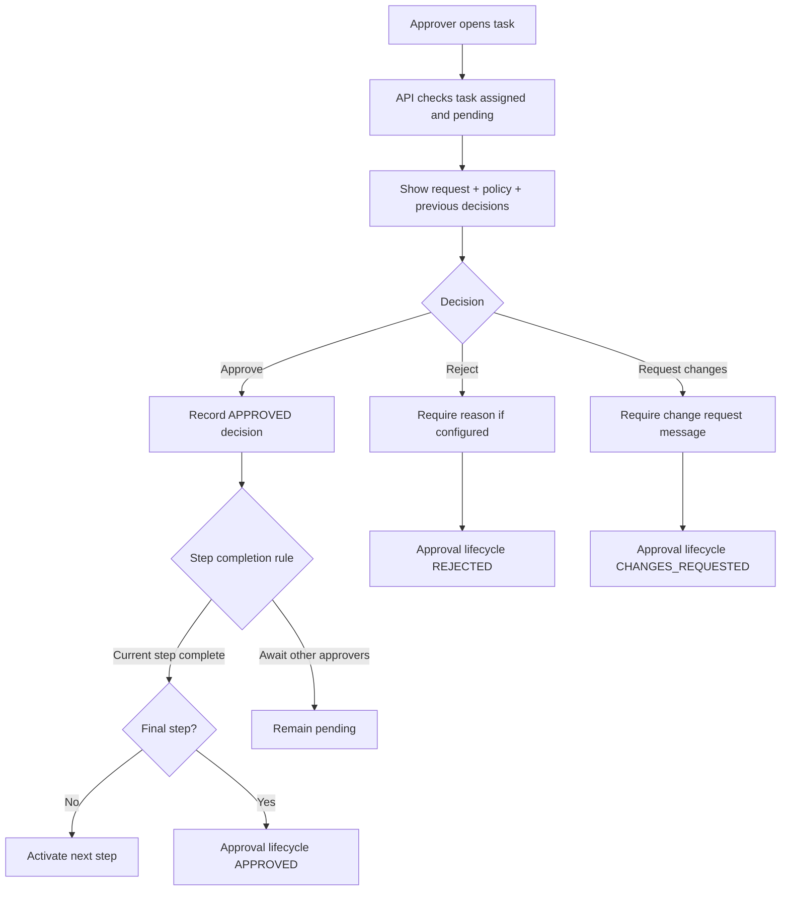
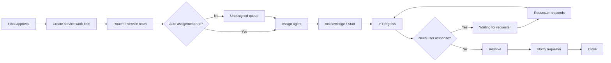
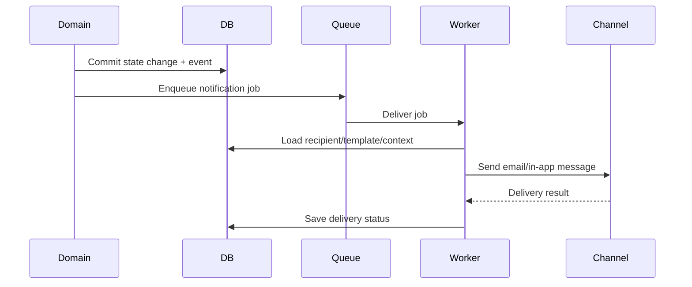

# Detailed Application Flow

## 1. End-to-end flow overview



---

## 2. Login flow



### Failure cases

| Condition | Result |
|---|---|
| Invalid password | Generic authentication error |
| User deactivated | Login denied |
| Expired access session | Refresh flow attempted |
| Refresh invalid/revoked | User returned to sign-in |
| SSO user has no mapped app account | Deny or invoke controlled provisioning flow |

---

## 3. Manual request creation flow

1. Employee opens **New Request**.
2. Frontend loads published request types allowed for that employee.
3. Employee selects a request type.
4. Backend returns request-type metadata and form schema.
5. Frontend renders dynamic form.
6. User enters fields and attaches documents.
7. Draft can auto-save.
8. Frontend performs client-side schema validation.
9. Backend performs authoritative validation.
10. Employee chooses **Submit**.
11. Server calculates workflow and approval routing.
12. Request becomes immutable enough to preserve submitted snapshot; future edits are controlled revisions.
13. First approval tasks are created.
14. Notifications are queued.
15. Employee is redirected to request detail with approval timeline.

---

## 4. AI-assisted request creation flow



### Confidence logic

Example:

- confidence ≥ 0.85 → preselect suggestion, still editable.
- 0.60–0.84 → show top 2–3 candidate request types.
- < 0.60 → do not guess; ask user to choose from likely categories or search catalog.

Thresholds should be configurable based on evaluation results, not treated as universal truths.

---

## 5. Submission transaction

Submission is a critical transactional boundary.

```text
BEGIN TRANSACTION
    1. Lock/load draft request
    2. Verify requester owns draft
    3. Validate form against published schema
    4. Freeze form/request-type version references
    5. Resolve applicable workflow version
    6. Create workflow instance snapshot
    7. Create first workflow step instance
    8. Resolve approver(s)
    9. Create approval task(s)
   10. Change request approval_state -> PENDING
   11. Append REQUEST_SUBMITTED event
   12. Append WORKFLOW_STARTED event
COMMIT

After commit:
   13. Enqueue notification jobs
```

If steps 1–12 fail, nothing should be partially submitted.

---

## 6. Workflow selection flow



Rule examples:

```text
request_type == REIMBURSEMENT AND amount < 5_000_000 VND
request_type == REIMBURSEMENT AND amount >= 5_000_000 VND
request_type == ACCESS_REQUEST AND system_risk == HIGH
requester.department_id == Engineering
```

Business-critical rule evaluation should be deterministic code/configuration, not LLM output.

---

## 7. Approver resolution

Each workflow step defines an approver resolver.

### Resolver: requester manager

```text
request.requester_id
-> users.manager_id
-> approver user
```

### Resolver: role within department

```text
requester.department_id
+ role = DEPARTMENT_HEAD
-> matching active user(s)
```

### Resolver: service team lead

```text
request_type.owner_service_team_id
-> service_team.lead_user_id
```

### Resolver: named approver

Workflow stores a user or group reference.

### Failure case

If no approver can be resolved:

- do not auto-approve,
- set workflow instance to an exception state,
- notify admin/service owner,
- show employee a neutral “routing requires administrator attention” status.

---

## 8. Approval decision flow



---

## 9. Parallel approval behavior

A workflow step can contain multiple approvers with one of these modes:

### `ALL`

All active approval tasks must be approved.

If any task rejects and policy says rejection is terminal, the step fails immediately.

### `ANY`

One approval completes the step. Remaining tasks are marked no-longer-required/cancelled.

### `MIN_N`

Future extension: at least `N` of `M` approvers must approve.

For MVP, implement `ALL` and optionally `ANY`. Avoid `MIN_N` until needed.

---

## 10. Request changes flow

1. Approver selects **Request changes**.
2. Approver enters required explanation.
3. Current active approval tasks are suspended/closed according to workflow policy.
4. Request becomes `CHANGES_REQUESTED`.
5. Employee receives notification.
6. Employee edits only allowed fields.
7. System stores revision metadata.
8. Employee re-submits.
9. Workflow policy determines whether:
   - restart from first approval, or
   - return to same step.

Recommended MVP rule: **restart the affected current step, preserve earlier approved steps only if no fields relevant to them changed**. A simpler first implementation may restart the full workflow and clearly record that behavior.

---

## 11. Rejection flow

On rejection:

- save actor,
- save timestamp,
- save reason,
- mark request approval lifecycle rejected,
- close remaining pending approval tasks,
- notify requester,
- append audit event,
- do not create service fulfillment work.

Admin should not “edit history” to turn a rejection into approval. A correction should be represented as a controlled new action/reopened request.

---

## 12. Post-approval fulfillment flow



---

## 13. SLA flow

Each request type may define:

- first response target,
- approval target,
- resolution target.

At submission/approval:

1. Calculate target timestamps using configured business calendar later; MVP can use elapsed clock time.
2. Store due time on relevant workflow/work item.
3. Scheduled worker checks due items.
4. At warning threshold, emit `SLA_AT_RISK`.
5. At breach, emit `SLA_BREACHED`.
6. Notification/escalation rules run.

Do not recompute historical due dates when an admin later changes the SLA configuration.

---

## 14. Notification flow



If notification delivery fails, the business transaction remains valid. Retry notification separately.

---

## 15. Policy RAG flow

1. Admin uploads policy PDF/DOCX/text.
2. Backend creates document metadata record.
3. Worker extracts text.
4. Worker chunks text.
5. Worker generates embeddings.
6. Chunks/embeddings saved.
7. User asks a policy question.
8. Server checks access scope.
9. Retrieve top relevant chunks.
10. Build grounded prompt.
11. Generate answer.
12. Return answer with internal citations/document references.
13. Log AI run metadata.

If retrieval score/evidence is weak, return a cautious “not enough policy evidence” response instead of fabricating a rule.

---

## 16. Request state tables

### Approval lifecycle

| Current | Action | Next |
|---|---|---|
| DRAFT | Submit | PENDING_APPROVAL |
| PENDING_APPROVAL | Approve final step | APPROVED |
| PENDING_APPROVAL | Reject | REJECTED |
| PENDING_APPROVAL | Request changes | CHANGES_REQUESTED |
| CHANGES_REQUESTED | Re-submit | PENDING_APPROVAL |
| DRAFT | Cancel | CANCELLED |
| PENDING_APPROVAL | Cancel if policy permits | CANCELLED |

### Fulfillment lifecycle

| Current | Action | Next |
|---|---|---|
| NOT_STARTED | Queue | QUEUED |
| QUEUED | Assign/start | IN_PROGRESS |
| IN_PROGRESS | Need employee input | WAITING_FOR_REQUESTER |
| WAITING_FOR_REQUESTER | Employee reply | IN_PROGRESS |
| IN_PROGRESS | Resolve | RESOLVED |
| RESOLVED | Confirm/auto-close | CLOSED |

---

## 17. Permission flow for every protected action

Every protected backend action should conceptually do:

```text
1. Authenticate actor
2. Load resource
3. Check actor role
4. Check resource relationship/scope
5. Check current state permits action
6. Validate input
7. Execute transaction
8. Audit
9. Trigger side effects asynchronously
```

This order prevents many common authorization bugs.

---

## 18. Example complete scenario

### Scenario: employee requests a laptop replacement

1. Huy signs in.
2. He selects “Ask AI.”
3. He writes that his laptop frequently crashes and interrupts customer meetings.
4. AI maps it to `IT_HARDWARE_REPLACEMENT`.
5. AI extracts reason and business impact.
6. It asks for cost center and preferred device class.
7. Huy confirms the structured draft.
8. Backend validates the request.
9. Workflow resolver finds:
   - Step 1: direct manager,
   - Step 2: IT lead.
10. Manager is notified and approves.
11. IT lead is notified and approves.
12. Request changes to `APPROVED`.
13. Service work is added to IT queue.
14. IT agent assigns the request to themselves.
15. Agent marks “In Progress.”
16. Agent adds an internal note about inventory.
17. Agent resolves request after issuing device.
18. Huy receives completion notification.
19. Request is closed.
20. Audit log contains classification run, submission, workflow selection, both human decisions, assignment, resolution, and closure.

This is the core demo that should work before advanced features are added.
