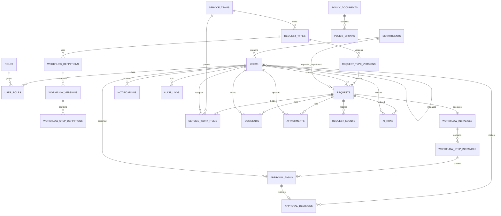
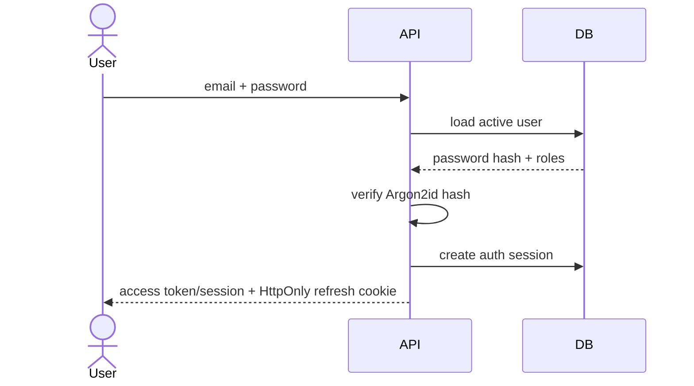

# Backend, Database, Storage & Authentication Design

## 1. Backend design goal

The backend should model a request as a governed lifecycle, not simply a row with a `status` string.

Core concerns:

- identity,
- organization,
- request definition,
- request instance,
- workflow definition,
- workflow execution,
- approval decisions,
- service fulfillment,
- comments and files,
- notifications,
- AI runs,
- knowledge documents,
- audit history.

---

## 2. Recommended backend directory structure

```text
apps/api/
├── alembic/
│   ├── versions/
│   └── env.py
├── app/
│   ├── main.py
│   ├── core/
│   │   ├── config.py
│   │   ├── database.py
│   │   ├── security.py
│   │   ├── logging.py
│   │   ├── middleware.py
│   │   ├── exceptions.py
│   │   └── dependencies.py
│   ├── modules/
│   │   ├── auth/
│   │   ├── users/
│   │   ├── organization/
│   │   ├── catalog/
│   │   ├── requests/
│   │   ├── workflows/
│   │   ├── approvals/
│   │   ├── fulfillment/
│   │   ├── comments/
│   │   ├── attachments/
│   │   ├── notifications/
│   │   ├── knowledge/
│   │   ├── ai/
│   │   ├── analytics/
│   │   └── audit/
│   ├── shared/
│   └── tests/
├── pyproject.toml
└── Dockerfile
```

---

## 3. Database entity map



---

## 4. Identity tables

### `users`

```text
id UUID PK
email CITEXT UNIQUE NOT NULL
password_hash TEXT NULL            # null for SSO-only user
display_name TEXT NOT NULL
employee_code TEXT NULL UNIQUE
department_id UUID FK NULL
manager_id UUID FK users.id NULL
external_identity_provider TEXT NULL
external_subject TEXT NULL
is_active BOOLEAN NOT NULL DEFAULT true
created_at TIMESTAMPTZ NOT NULL
updated_at TIMESTAMPTZ NOT NULL
```

Indexes:

- unique lower/citext email,
- department_id,
- manager_id,
- external provider + subject unique when present.

### `roles`

```text
id UUID PK
code TEXT UNIQUE NOT NULL
name TEXT NOT NULL
description TEXT
```

### `user_roles`

```text
user_id UUID FK users.id
role_id UUID FK roles.id
scope_type TEXT NULL
scope_id UUID NULL
created_at TIMESTAMPTZ
PRIMARY KEY(user_id, role_id, scope_type, scope_id)
```

Scope fields allow future department/service-team scoped roles.

### `departments`

```text
id UUID PK
code TEXT UNIQUE
name TEXT
parent_department_id UUID NULL
head_user_id UUID NULL
is_active BOOLEAN
```

### `service_teams`

```text
id UUID PK
code TEXT UNIQUE
name TEXT
lead_user_id UUID NULL
is_active BOOLEAN
```

Optional association table can support many users per service team.

---

## 5. Request catalog tables

### `request_types`

Stable logical identity.

```text
id UUID PK
code TEXT UNIQUE NOT NULL
category TEXT NOT NULL
owner_service_team_id UUID FK
is_active BOOLEAN
created_at TIMESTAMPTZ
```

### `request_type_versions`

Published configuration is versioned.

```text
id UUID PK
request_type_id UUID FK
version INTEGER NOT NULL
title TEXT NOT NULL
description TEXT
form_schema JSONB NOT NULL
validation_schema JSONB NULL
sla_config JSONB NULL
attachment_config JSONB NULL
status TEXT NOT NULL               # DRAFT/PUBLISHED/RETIRED
published_at TIMESTAMPTZ NULL
created_by UUID FK users.id
created_at TIMESTAMPTZ
UNIQUE(request_type_id, version)
```

Why version request types?

A request submitted six months ago should still point to the form/policy configuration that existed when it was submitted.

---

## 6. Request table

### `requests`

```text
id UUID PK
request_number TEXT UNIQUE NOT NULL
requester_id UUID FK users.id NOT NULL
requester_department_id UUID FK departments.id NULL
request_type_version_id UUID FK request_type_versions.id NOT NULL

title TEXT NOT NULL
description TEXT NULL
form_data JSONB NOT NULL

priority TEXT NOT NULL DEFAULT 'NORMAL'
approval_state TEXT NOT NULL
fulfillment_state TEXT NOT NULL
aggregate_status TEXT NOT NULL

submitted_at TIMESTAMPTZ NULL
approved_at TIMESTAMPTZ NULL
resolved_at TIMESTAMPTZ NULL
closed_at TIMESTAMPTZ NULL
cancelled_at TIMESTAMPTZ NULL

due_at TIMESTAMPTZ NULL
created_at TIMESTAMPTZ NOT NULL
updated_at TIMESTAMPTZ NOT NULL
```

### Why `form_data` JSONB?

Request types are dynamic. JSONB lets the product add new form fields without changing DB schema for every form.

### What should not live only in JSONB?

Fields needed for:

- relationships,
- authorization,
- frequent filtering,
- workflow execution,
- reporting,
- integrity constraints

should be relational/typed columns or extracted into specialized tables.

---

## 7. Workflow definition tables

### `workflow_definitions`

```text
id UUID PK
code TEXT UNIQUE
name TEXT
request_type_id UUID FK
is_active BOOLEAN
```

### `workflow_versions`

```text
id UUID PK
workflow_definition_id UUID FK
version INTEGER
trigger_rule JSONB
status TEXT
published_at TIMESTAMPTZ NULL
created_by UUID
created_at TIMESTAMPTZ
UNIQUE(workflow_definition_id, version)
```

### `workflow_step_definitions`

```text
id UUID PK
workflow_version_id UUID FK
step_order INTEGER
name TEXT
approval_mode TEXT             # ALL / ANY
approver_resolver_type TEXT    # MANAGER / ROLE / USER / TEAM_LEAD
approver_resolver_config JSONB
condition_rule JSONB NULL
due_duration_minutes INTEGER NULL
escalation_config JSONB NULL
UNIQUE(workflow_version_id, step_order)
```

A richer engine can later support DAG edges instead of simple ordered steps.

---

## 8. Workflow runtime tables

### `workflow_instances`

```text
id UUID PK
request_id UUID UNIQUE FK
workflow_version_id UUID FK
status TEXT
started_at TIMESTAMPTZ
completed_at TIMESTAMPTZ NULL
snapshot JSONB NOT NULL
```

`snapshot` preserves relevant workflow configuration used for that request.

### `workflow_step_instances`

```text
id UUID PK
workflow_instance_id UUID FK
step_definition_id UUID NULL
step_order INTEGER
name TEXT
status TEXT                 # PENDING/ACTIVE/APPROVED/REJECTED/SKIPPED
approval_mode TEXT
activated_at TIMESTAMPTZ NULL
completed_at TIMESTAMPTZ NULL
due_at TIMESTAMPTZ NULL
```

### `approval_tasks`

```text
id UUID PK
workflow_step_instance_id UUID FK
approver_user_id UUID FK users.id
status TEXT                 # PENDING/APPROVED/REJECTED/CANCELLED
assigned_at TIMESTAMPTZ
acted_at TIMESTAMPTZ NULL
version INTEGER DEFAULT 1   # optional optimistic concurrency
```

### `approval_decisions`

```text
id UUID PK
approval_task_id UUID UNIQUE FK
actor_user_id UUID FK users.id
decision TEXT               # APPROVE/REJECT/REQUEST_CHANGES
comment TEXT NULL
created_at TIMESTAMPTZ
```

Keep decisions separate from tasks so the historical action is explicit.

---

## 9. Fulfillment tables

### `service_work_items`

```text
id UUID PK
request_id UUID UNIQUE FK
service_team_id UUID FK
assignee_user_id UUID NULL
status TEXT
priority TEXT
queued_at TIMESTAMPTZ
started_at TIMESTAMPTZ NULL
waiting_since TIMESTAMPTZ NULL
resolved_at TIMESTAMPTZ NULL
closed_at TIMESTAMPTZ NULL
due_at TIMESTAMPTZ NULL
resolution_summary TEXT NULL
```

Optional later:

- task subtasks,
- inventory/procurement links,
- external ticket ID,
- multiple fulfillment tasks per request.

---

## 10. Comments and notes

### `comments`

```text
id UUID PK
request_id UUID FK
author_user_id UUID FK
body TEXT NOT NULL
visibility TEXT NOT NULL      # REQUESTER_VISIBLE / INTERNAL
created_at TIMESTAMPTZ
edited_at TIMESTAMPTZ NULL
```

Internal notes require explicit permission.

Avoid hard-deleting comments in audited environments. If edit/delete is allowed, preserve history or tombstone metadata.

---

## 11. Attachments

### `attachments`

```text
id UUID PK
request_id UUID FK
uploaded_by UUID FK
object_key TEXT UNIQUE
original_filename TEXT
mime_type TEXT
size_bytes BIGINT
sha256 TEXT NULL
visibility TEXT
status TEXT                 # PENDING/READY/QUARANTINED/DELETED
created_at TIMESTAMPTZ
```

Binaries live in S3/MinIO, not in this table.

---

## 12. Request event timeline

### `request_events`

This is the user-facing/domain event timeline.

```text
id UUID PK
request_id UUID FK
event_type TEXT NOT NULL
actor_user_id UUID NULL
payload JSONB NOT NULL
created_at TIMESTAMPTZ NOT NULL
```

Examples:

- REQUEST_CREATED
- REQUEST_SUBMITTED
- AI_DRAFT_CREATED
- WORKFLOW_STARTED
- APPROVAL_ASSIGNED
- APPROVAL_APPROVED
- APPROVAL_REJECTED
- CHANGES_REQUESTED
- REQUEST_REVISED
- SERVICE_ASSIGNED
- SERVICE_STARTED
- REQUESTER_REPLY
- REQUEST_RESOLVED
- REQUEST_CLOSED

This table supports the readable timeline.

---

## 13. Audit log

### `audit_logs`

Audit logs are broader than request events.

```text
id UUID PK
actor_user_id UUID NULL
action TEXT NOT NULL
resource_type TEXT NOT NULL
resource_id UUID NULL
request_id UUID NULL
ip_address INET NULL
user_agent TEXT NULL
before_data JSONB NULL
after_data JSONB NULL
metadata JSONB NULL
created_at TIMESTAMPTZ NOT NULL
```

Audit logs should capture:

- role changes,
- workflow publication,
- request-type configuration changes,
- privileged request access when needed,
- approval decisions,
- service assignment changes,
- auth security events.

Do not store secrets in before/after snapshots.

---

## 14. Notification tables

### `notifications`

```text
id UUID PK
recipient_user_id UUID FK
request_id UUID NULL
type TEXT
channel TEXT               # IN_APP / EMAIL / TEAMS / SLACK
subject TEXT NULL
body TEXT
status TEXT                # PENDING/SENT/FAILED/READ
created_at TIMESTAMPTZ
sent_at TIMESTAMPTZ NULL
read_at TIMESTAMPTZ NULL
```

Optional `notification_deliveries` child table if one logical notification can fan out to multiple channels.

---

## 15. AI data model

### `ai_runs`

```text
id UUID PK
initiated_by UUID FK users.id NULL
request_id UUID FK requests.id NULL
run_type TEXT                   # CLASSIFY/EXTRACT/SUMMARIZE/POLICY_QA
provider TEXT
model_name TEXT
prompt_template_version TEXT
input_hash TEXT NULL
structured_output JSONB NULL
confidence NUMERIC NULL
latency_ms INTEGER NULL
usage_metadata JSONB NULL
status TEXT
error_code TEXT NULL
created_at TIMESTAMPTZ
```

Avoid storing raw sensitive prompts unless there is a clear operational need and retention policy.

AI run records are useful for evaluation and debugging but must obey data-protection rules.

---

## 16. Knowledge base tables

### `policy_documents`

```text
id UUID PK
title TEXT
version TEXT NULL
department_id UUID NULL
effective_from DATE NULL
effective_to DATE NULL
object_key TEXT
access_scope JSONB
status TEXT
created_by UUID
created_at TIMESTAMPTZ
```

### `policy_chunks`

```text
id UUID PK
policy_document_id UUID FK
chunk_index INTEGER
text_content TEXT
source_locator JSONB           # page/section/heading
embedding VECTOR(...)
metadata JSONB
```

Vector dimension depends on chosen embedding model, so define it at implementation time.

---

## 17. Refresh token/session tables

If using local token-based auth:

### `auth_sessions`

```text
id UUID PK
user_id UUID FK
refresh_token_hash TEXT UNIQUE
expires_at TIMESTAMPTZ
revoked_at TIMESTAMPTZ NULL
replaced_by_session_id UUID NULL
ip_address INET NULL
user_agent TEXT NULL
created_at TIMESTAMPTZ
```

Benefits:

- logout/revocation,
- refresh rotation,
- session listing,
- suspicious reuse detection.

---

## 18. Authentication flow

### Local login



### Refresh

1. Browser sends refresh cookie.
2. Backend hashes/looks up token.
3. Ensure session active and unexpired.
4. Rotate refresh session/token.
5. Revoke old token.
6. Return new access credential and refresh cookie.

### Logout

Revoke current session server-side and clear cookie.

---

## 19. Authorization rules

Create explicit functions/policies such as:

```text
can_view_request(actor, request)
can_edit_draft(actor, request)
can_submit_request(actor, request)
can_decide_approval(actor, approval_task)
can_manage_service_work(actor, work_item)
can_view_internal_notes(actor, request)
can_manage_workflow(actor)
can_view_audit_log(actor)
```

Avoid scattering role strings across routers.

### Example `can_view_request`

Allow when one of:

- actor is requester,
- actor is current/past authorized approver,
- actor is assigned service agent,
- actor belongs to owning service team with appropriate role,
- actor is authorized manager under configured team visibility,
- actor is admin/auditor with scope.

---

## 20. Transaction boundaries

Actions that must be atomic:

- request submission + workflow start,
- approval decision + next step activation,
- rejection + cancellation of remaining approval tasks,
- service resolution + request event,
- workflow publication + version state update.

External calls such as email or LLM generation should normally occur outside these core DB transactions.

---

## 21. Concurrency controls

Potential race:

Two browser tabs try to approve the same task.

Protect using:

- row lock (`SELECT ... FOR UPDATE`) or
- optimistic version field and conditional update.

If second decision arrives after first:

```http
409 Conflict
```

UI message:

> “This approval has already been completed. Refreshing the latest state.”

---

## 22. Database indexes

High-value indexes may include:

```text
requests(requester_id, created_at DESC)
requests(aggregate_status, updated_at DESC)
requests(request_type_version_id)
approval_tasks(approver_user_id, status, assigned_at DESC)
workflow_step_instances(workflow_instance_id, step_order)
service_work_items(service_team_id, status, due_at)
service_work_items(assignee_user_id, status)
request_events(request_id, created_at)
notifications(recipient_user_id, status, created_at DESC)
audit_logs(resource_type, resource_id, created_at DESC)
```

Use `EXPLAIN ANALYZE` before adding speculative indexes in large numbers.

---

## 23. Data retention and deletion

Recommended principles:

- User accounts: deactivate rather than delete if referenced by history.
- Audit logs: long retention according to organization policy.
- Attachments: retention configurable by request category.
- AI raw inputs: retain minimally.
- Knowledge documents: version and retire rather than silently replace.

Actual retention periods should be determined by legal/security requirements of the deploying organization.

---

## 24. Seed data for demo

Create fixtures for:

### Departments

- Engineering
- Finance
- Human Resources
- Information Technology

### Users

- 1 employee.
- 1 direct manager.
- 1 IT service lead.
- 1 service agent.
- 1 admin.

### Request types

1. Laptop Replacement.
2. Software Access.
3. Expense Reimbursement.

### Workflows

Laptop:

```text
Manager -> IT Lead
```

Software Access:

```text
Manager -> Application Owner
```

Expense:

```text
< 5,000,000 VND: Manager -> Finance
>= 5,000,000 VND: Manager -> Department Head -> Finance
```

This seed data makes the project immediately demoable.
